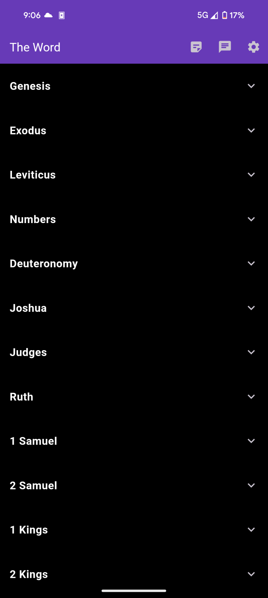

# The Word

## Features

- **Multiple Bible Translations**: Access a variety of Bible versions, including ESV, BSB, and more.
- **AI-Powered Insights**: Use Gemini AI to get contextual explanations, historical backgrounds, and personalized reading recommendations.
- **User-Friendly Interface**: Simple and intuitive design for a smooth user experience.

## Gemini AI Integration

The app leverages Gemini AI to provide a rich, interactive Bible study experience. With Gemini AI, users can:

- Ask questions about specific verses or topics.
- Receive suggestions for further reading based on personal interests.
- Gain deeper insights into biblical contexts and themes.

## Screenshots

1**Bible Reader**
    
    
    
   *Description*: The reading interface offers a clean, distraction-free view of the Bible text, with options for highlighting and notes.

2 **Customizable Interface**
    
    *Description*: The reading interface offers a clean, distraction-free view of the Bible text, with options for highlighting and notes.

3 **AI Interaction**
   
   *Description*: Interact with Gemini AI to get detailed explanations, historical context, and recommendations based on your reading habits.

