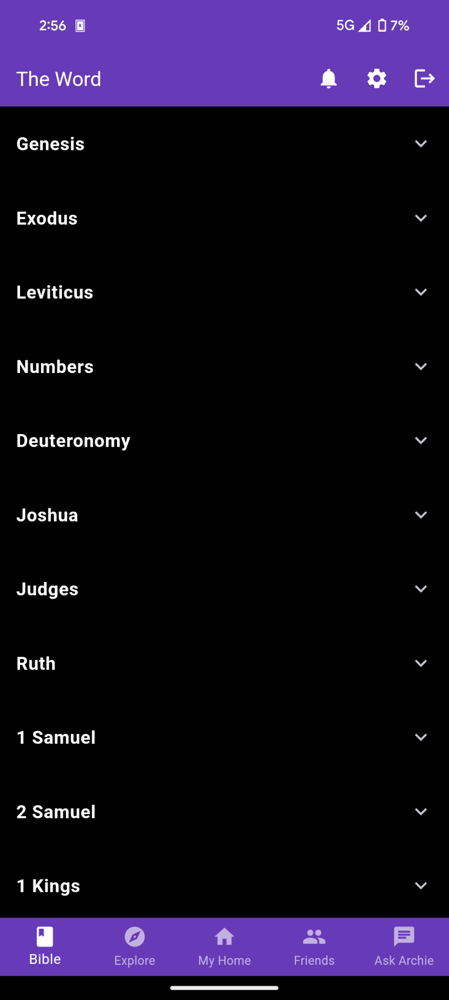
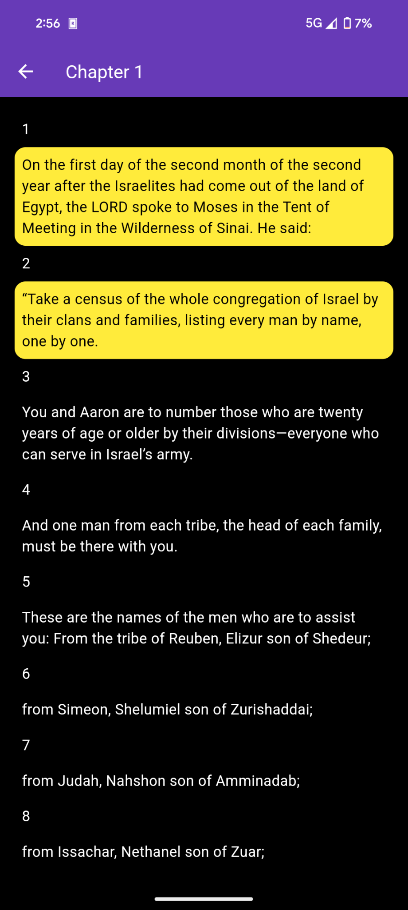
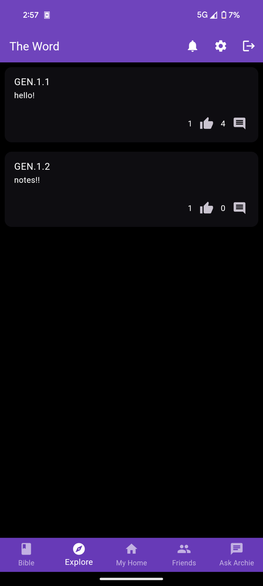
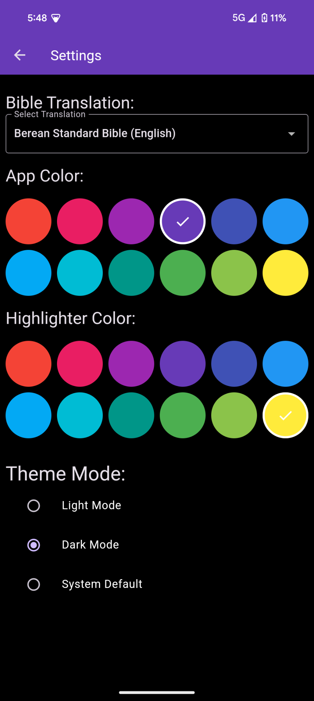

# The Word

Welcome to The Word, your companion in Bible study, meticulously crafted in Flutter to elevate your spiritual journey. Whether you're seeking clarity, historical context, or personalized insights, The Word offers a sophisticated yet accessible platform to delve into scripture with depth and ease.

## Table of Contents
- [Features](#features)
  - [Multiple Bible Translations](#multiple-bible-translations)
  - [AI-Powered Insights](#ai-powered-insights)
  - [User-Friendly Interface](#user-friendly-interface)
- [Screenshots](#screenshots)
- [Support and Feedback](#support-and-feedback)
- [How It Works](#how-it-works)

## Features

### Multiple Bible Translations
Explore various Bible versions including ESV, BSB, and more. Compare translations to deepen your understanding of scripture.

### AI-Powered Insights
Harness the power of Gemini AI for contextual explanations, historical backgrounds, and personalized reading recommendations. Dive deeper into the Word with intelligent insights at your fingertips.

### User-Friendly Interface
Enjoy a seamless user experience with our intuitive design. Navigate effortlessly through features and content, ensuring a smooth and engaging study session.

## Screenshots

### Bible Reader
1. **Bible Reader**
   
   
   
   *Description*: Immerse yourself in a serene reading experience with our distraction-free interface, designed to highlight key passages and encourage personal reflection through customizable notes and highlights.

### Customizable Interface
2. **Customizable Interface**
   
   *Description*: Tailor your reading experience with flexible settings that cater to your preferences, ensuring a personalized and comfortable journey through scripture.

### AI Interaction
3. **AI Interaction**
   
   *Description*: Engage with Gemini AI for insightful explanations, historical context, and personalized recommendations tailored to enhance your understanding and deepen your connection with scripture.

## Support and Feedback

For support or feedback, please reach out to us at [support@github.com](https://github.com/billyrigdon/TheWord). 
We'd love to hear from you and help you with any questions or issues you may have.📧

We're here to support you on your journey with The Word!👍
## How It Works

The Word leverages Gemini AI to revolutionize your Bible study:
- **Ask Questions**: Seek clarity on specific verses or explore theological topics with ease.
- **Personalized Recommendations**: Receive tailored suggestions for further reading based on your interests and study habits.
- **Deeper Insights**: Gain a deeper understanding of biblical contexts and themes through interactive AI-driven analysis.

Built with Flutter, The Word combines cutting-edge technology with timeless scripture, empowering users to engage with the Bible in new and meaningful ways.
